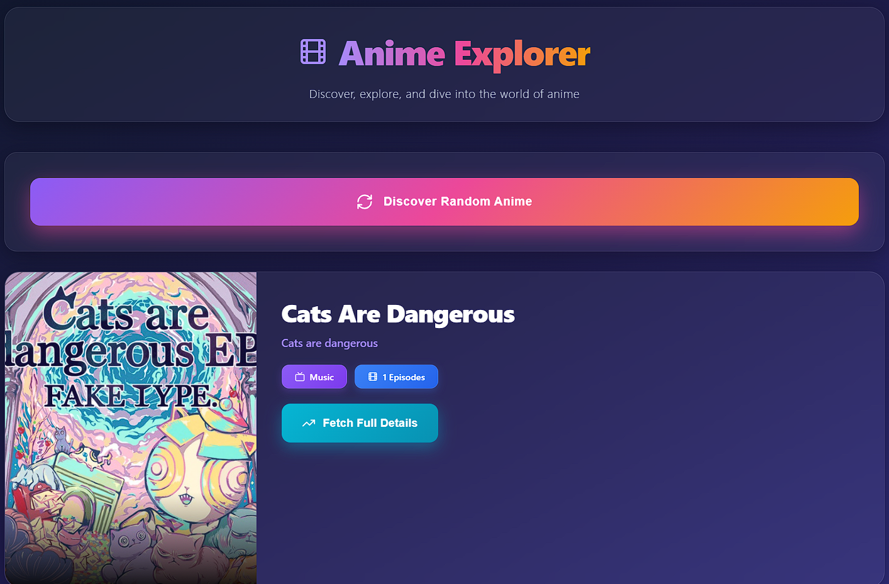
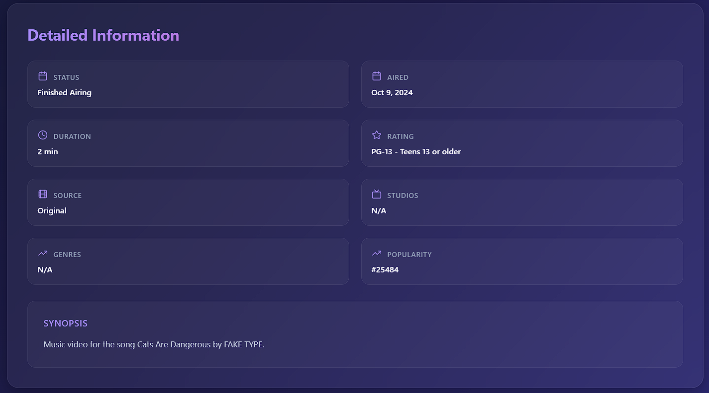
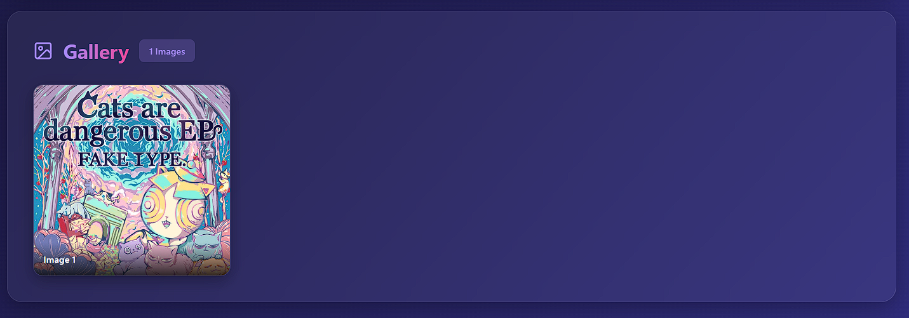

# 🎌 Anime Explorer

A modern, full-stack web application for discovering and exploring anime. Built with React and Node.js, this application fetches data from the Jikan API (unofficial MyAnimeList API) to provide users with a seamless anime discovery experience.


## 📋 Table of Contents

- [Features](#features)
- [Tech Stack](#tech-stack)
- [Prerequisites](#prerequisites)
- [Installation](#installation)
- [Usage](#usage)
- [Project Structure](#project-structure)
- [API Endpoints](#api-endpoints)
- [Screenshots](#screenshots)
- [Contributing](#contributing)
- [License](#license)
- [Acknowledgments](#acknowledgments)

## ✨ Features

- **Random Anime Discovery**: Get a random anime recommendation with a single click
- **Detailed Information**: View comprehensive anime details including:
  - Synopsis and description
  - Airing status and duration
  - Genres and studios
  - Rating and popularity metrics
- **Image Gallery**: Browse through multiple images from each anime
- **Modern UI/UX**: Sleek glassmorphism design with smooth animations
- **Responsive Design**: Fully responsive layout for all device sizes
- **Real-time Data**: Fetches live data from the Jikan API

## 🛠️ Tech Stack

### Frontend
- **React** 18.2.0 - JavaScript library for building user interfaces
- **Lucide React** - Beautiful & consistent icon set
- **CSS-in-JS** - Inline styling with modern CSS features

### Backend
- **Node.js** - JavaScript runtime environment
- **Express.js** - Fast, unopinionated web framework
- **Axios** - Promise-based HTTP client
- **CORS** - Cross-Origin Resource Sharing middleware

### External API
- **Jikan API v4** - Unofficial MyAnimeList API

## 📦 Prerequisites

Before you begin, ensure you have the following installed:

- **Node.js** (version 18.0 or higher)
- **npm** (version 8.0 or higher)
- **Git** (for cloning the repository)

Check your installations:

```bash
node --version
npm --version
git --version
```

## 🚀 Installation

### 1. Clone the Repository

```bash
git clone https://github.com/YOUR_USERNAME/anime-explorer.git
cd anime-explorer
```

### 2. Install Backend Dependencies

```bash
cd anime-explorer-backend
npm install
```

### 3. Install Frontend Dependencies

```bash
cd ../anime-explorer-frontend
npm install
```

## 💻 Usage

### Running the Application

You need to run both the backend and frontend servers simultaneously.

#### Terminal 1 - Backend Server

```bash
cd anime-explorer-backend
npm run dev
```

The backend server will start on `http://localhost:3001`

#### Terminal 2 - Frontend Server

```bash
cd anime-explorer-frontend
npm start
```

The frontend application will open automatically in your browser at `http://localhost:3000`

### Development Mode

- **Backend**: Uses `nodemon` for automatic server restart on file changes
- **Frontend**: Uses React's hot-reload for instant updates

### Production Build

To create a production build of the frontend:

```bash
cd anime-explorer-frontend
npm run build
```

This will create an optimized production build in the `build` folder.

## 📁 Project Structure

```
anime-explorer/
├── anime-explorer-backend/
│   ├── node_modules/
│   ├── server.js           # Main backend server file
│   ├── package.json        # Backend dependencies
│   └── package-lock.json
│
├── anime-explorer-frontend/
│   ├── node_modules/
│   ├── public/
│   │   └── index.html      # HTML template
│   ├── src/
│   │   ├── App.js          # Main React component
│   │   ├── index.js        # React entry point
│   │   └── index.css       # Global styles
│   ├── package.json        # Frontend dependencies
│   └── package-lock.json
│
├── .gitignore
└── README.md
```

## 🔌 API Endpoints

The backend exposes the following REST API endpoints:

### Health Check
```
GET /api/health
```
Returns server status and timestamp.

**Response:**
```json
{
  "status": "OK",
  "message": "Anime Explorer Backend is running!",
  "timestamp": "2024-01-01T00:00:00.000Z"
}
```

### Get Random Anime
```
GET /api/random-anime
```
Fetches a random anime from the Jikan API.

**Response:**
```json
{
  "id": 1,
  "title": "Cowboy Bebop",
  "titleJapanese": "カウボーイビバップ",
  "image": "https://cdn.myanimelist.net/images/anime/4/19644.jpg",
  "type": "TV",
  "episodes": 26,
  "score": 8.78
}
```

### Get Anime Details
```
GET /api/anime/:id
```
Fetches detailed information about a specific anime.

**Parameters:**
- `id` (required) - MyAnimeList anime ID

**Response:**
```json
{
  "id": 1,
  "title": "Cowboy Bebop",
  "status": "Finished Airing",
  "aired": "Apr 3, 1998 to Apr 24, 1999",
  "duration": "24 min per ep",
  "rating": "R - 17+ (violence & profanity)",
  "source": "Original",
  "studios": "Sunrise",
  "genres": "Action, Adventure, Drama, Sci-Fi",
  "popularity": 43,
  "synopsis": "...",
  ...
}
```

### Get Anime Pictures
```
GET /api/anime/:id/pictures
```
Fetches all available pictures for a specific anime.

**Parameters:**
- `id` (required) - MyAnimeList anime ID

**Response:**
```json
[
  {
    "large": "https://cdn.myanimelist.net/images/anime/4/19644l.jpg",
    "small": "https://cdn.myanimelist.net/images/anime/4/19644.jpg"
  },
  ...
]
```

## 🎨 Screenshots

### Main Interface


### Anime Details


### Image Gallery


## 🤝 Contributing

Contributions are welcome! Here's how you can help:

1. **Fork the repository**
2. **Create a feature branch**
   ```bash
   git checkout -b feature/AmazingFeature
   ```
3. **Commit your changes**
   ```bash
   git commit -m 'Add some AmazingFeature'
   ```
4. **Push to the branch**
   ```bash
   git push origin feature/AmazingFeature
   ```
5. **Open a Pull Request**

### Coding Standards

- Use meaningful variable and function names
- Follow existing code style and formatting
- Comment complex logic
- Test your changes thoroughly

## 📝 License

This project is licensed under the MIT License - see the [LICENSE](LICENSE) file for details.

## 🙏 Acknowledgments

- **[Jikan API](https://jikan.moe/)** - For providing free access to MyAnimeList data
- **[MyAnimeList](https://myanimelist.net/)** - For the comprehensive anime database
- **[Lucide Icons](https://lucide.dev/)** - For the beautiful icon set
- **[React](https://react.dev/)** - For the amazing frontend framework

## 📧 Contact

Md Mazidul Hasan - [@linkedin](https://www..com/in/md-mazidul-hasan-rumman/)

Project Link: [https://github.com/MazidulHasan/Anime-Explorer.git](https://github.com/YOUR_USERNAME/anime-explorer)

---

## 🐛 Known Issues

- Jikan API has rate limits; excessive requests may result in temporary blocks
- Some anime may not have all information available
- Large image galleries may take time to load on slower connections

## 🔮 Future Enhancements

- [ ] User authentication and favorites system
- [ ] Search functionality by name, genre, or year
- [ ] Filtering and sorting options
- [ ] Anime recommendations based on user preferences
- [ ] Watchlist management
- [ ] Dark/Light theme toggle
- [ ] Pagination for large datasets
- [ ] Caching mechanism to reduce API calls

## 🔧 Troubleshooting

### Port Already in Use

If you get an error that port 3000 or 3001 is already in use:

```bash
# Windows
netstat -ano | findstr :3001
taskkill /PID <PID_NUMBER> /F

# Mac/Linux
lsof -ti:3001 | xargs kill -9
```

### CORS Errors

Ensure the backend URL in `App.js` matches your backend server:
```javascript
const BACKEND_URL = 'http://localhost:3001/api';
```

### Jikan API Rate Limiting

If you're getting rate limit errors, wait a few seconds between requests. The backend includes automatic delays, but rapid clicking may still trigger limits.

---

⭐ **If you found this project helpful, please consider giving it a star!** ⭐